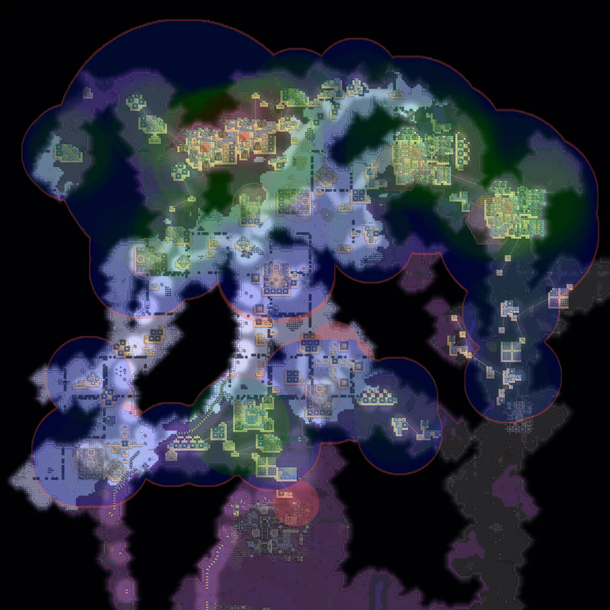

# Dps Heatmap

* Display dps heatmap.
* DPS calculated by vanilla. (may not precise enough)

## Quick Settings For Desktop

All keybinds are capable to set custom.

Here are available quick settings for desktop.
* **[ F1 ]** Toggle setting DPS Heatmap Enable
* **[ F2 ]** Toggle setting show Player's DPS Heatmap
* **[ F3 ]** Switch setting targetMode (Ground, Fly or Both)

## Preview

